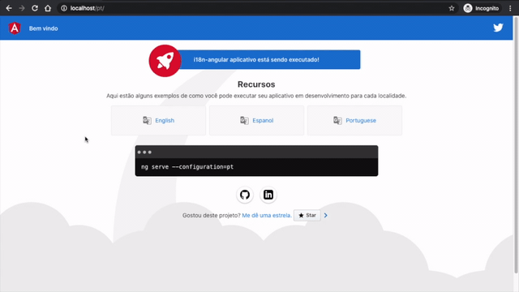

# i18n Angular

<p align=“center”>
    
</p>

This project is a demonstration of how to internationalisation an Angular application. The project was generated with [Angular CLI](https://github.com/angular/angular-cli) version 8.3.23.

Here you can see the application running using the locales:

- English
- Spanish
- Portuguese

## Project demo

This project was publish on **GitHub Pages** and can be accessed by this [link](https://rodolfodella.github.io/i18n-angular/en/).

## Run application

To run this application you can choose to run in development or production, but:

- If you run in development the project doesn’t work when you click on buttons, this because when you run in development you need pass a configuration flag set what locale you want to run.
- If you generate a production version, then you will need to use a proxy to redirect your request. In my case, I’m using the **NGINX**

## Development server

Run `ng serve` for a dev server and the project load default `messages.xlf` file.

> The default locale for Angular applications when not configured is **en-US**

### Run with an English locale

Run `ng serve --configurations=en` or just `ng serve --c=en` for a dev server and the project will load the `messages.en.xlf`

> Navigate to `http://localhost:4200/i18n-angular/en`

### Run with a Spanish locale

Run `ng serve --configurations=es` or just `ng serve --c=es` for a dev server and the project will load the `messages.es.xlf`

> Navigate to `http://localhost:4200/i18n-angular/es`

### Run with a Portuguese locale

Run `ng serve --configurations=pt` or just `ng serve --c=pt` for a dev server and the project will load the `messages.pt.xlf`

> Navigate to `http://localhost:4200/i18n-angular/pt`

## Build

To default build run `ng build` to build the project or run `ng build --c=production-en && ng build --c=production-es && ng build --c=production-pt` to build the project for all locales.

The build artefacts will be stored in the `dist/` directory. Use the `--prod` flag for a production build.

## Running on server

To test this application, I simulate environment production using Docker. For understand, when you compile a version to deploy in production, you will need to generate one for each locale and to use a proxy to do the redirections.

Bellow, I show you the container structure and follow how I created a simple container to run this project.

### The structure

```
├── default.conf
├── docker-compose.yml
└── i18n-angular
    ├── en
    ├── es
    └── pt
```

### The `default.conf` file

```
server {
    listen 80;

    location /i18n-angular/en {
      alias /usr/share/nginx/html/i18n-angular/en/;
      try_files $uri$args $uri$args/ $uri $uri/ /index.html;
    }

    location /i18n-angular/es {
      alias /usr/share/nginx/html/i18n-angular/es/;
      try_files $uri$args $uri$args/ $uri $uri/ /index.html;
    }

    location /i18n-angular/pt {
      alias /usr/share/nginx/html/i18n-angular/pt/;
      try_files $uri$args $uri$args/ $uri $uri/ /index.html;
    }

    location /i18n-angular/ {
      alias /usr/share/nginx/html/i18n-angular/pt/;
      try_files $uri$args $uri$args/ $uri $uri/ /index.html;
    }

    error_page 500 502 503 504 /50x.html;
    location = /50x.html {
      root /usr/share/nginx/html;
    }
}
```

### The `docker-compose.yml` file

```
web:
  image: nginx
  container_name: nginx
  volumes:
    - ./default.conf:/etc/nginx/conf.d/default.conf
    - ./i18n-angular:/usr/share/nginx/html/i18n-angular/
  ports:
    - "80:80"
```

> If you prefer to run without a `docker-compose` file, feel free to do it. I did that because I like to organize all files in a folder.
